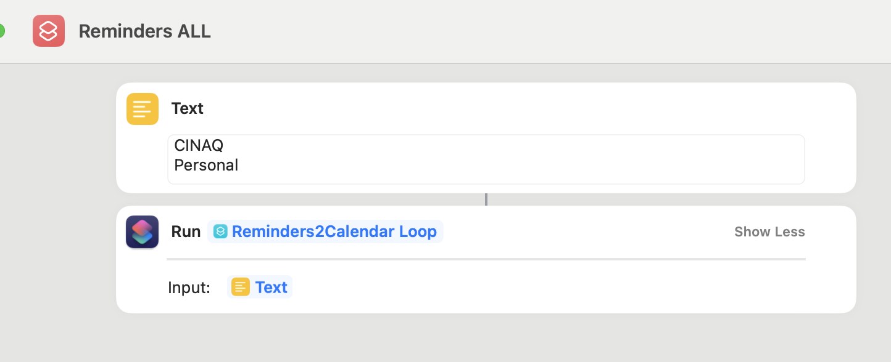
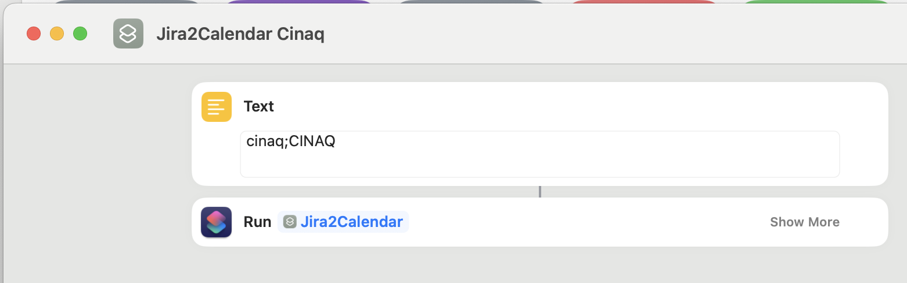

# Reminders2Calendar

This repo contains a collection of scripts that synchronizes reminders from Reminders.app to Calendar.app. It works best on iOS. 

Background info located at https://cinaq.com/blog/2022/11/22/the-missing-link-between-reminders-and-calendar-app-on-ios/

## Installation

> If you have existing shortcut versions, remove them, download from this repo and import them again. You can keep your personalized shortcuts.

### iOS (iphone, ipad)

- Open Shortcuts.app
- Reminders list name: this is the name of your reminders list. It also must match with your calendar name.
- Import your shortcuts on your iPhone.

### Mac OSX (macbook)

- On your mac open Shortcuts.app
- import the shortcut files from this repo
- configure the shortcuts to your liking

## Sample usage Reminders2Calendar

Leverages a helper loop shortcut contributed by @schaafjs

## Sample usage Jira2Calendar

Call `Jira2Calendar` with the format: `JiraCloudName;CalendarName`. JiraCloudName is used to construct the URL to jira issues in the calendar event.

## Changelog

### 2023-09-07

- Improved the license notes and probably some unknown refactoring as it's hard to trace back due to binary format
- Reminders2Calendar now accepts a tuple of format `RemindersName;CalendarName`, with this the Reminders List name can be different than the calendar name.
- Added JiraCalendar for similar experience if you have Jira

### 2023-06-21

- bugfix to mark completed reminders older than today

### 2023-06-18

- refactor to use wide range of calendar event search to simplify the logic. No need to do 2 searches anymore

### 2023-05-19
- Fixes duplication of completed reminders in the calendar

### 2023-05-18
- Fixes event duplication

